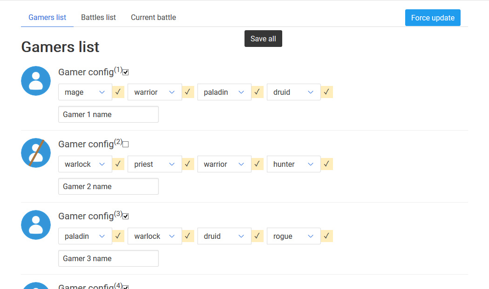
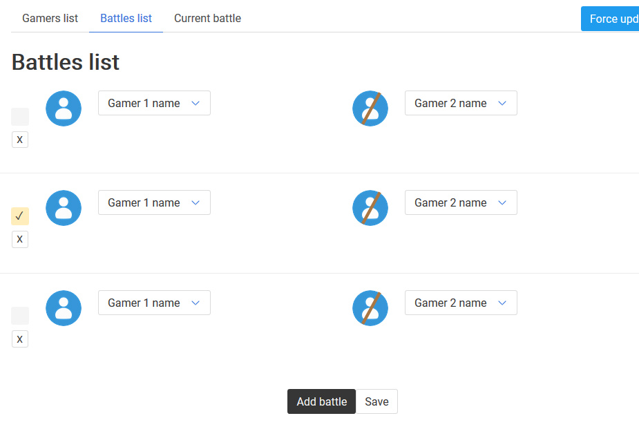
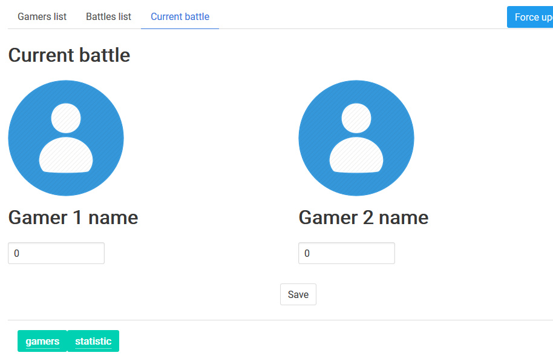
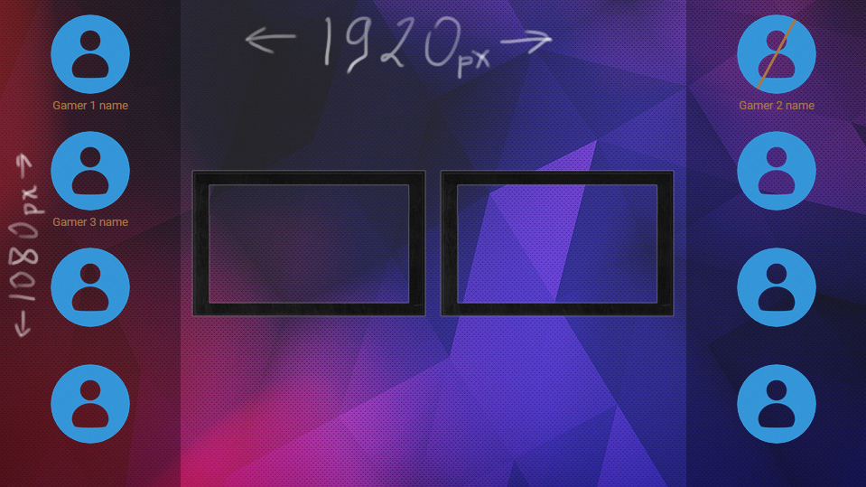
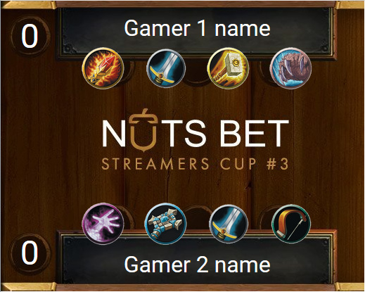

# Hearthstone-statistic  

## Simple heartstone statistic helper for streamers

### Capabilities:

1. Displaying the list of players.
    - 

        
Photo, status (left the game or not), player's name.

        
        
        
        
      
      

1. Displays the current battle:
    - 

        
Statistics of the gamers list (account).

        
        
        
      

    - 

        
Statistics of the current battle (available classes).

        
        

      

### Sponsor

